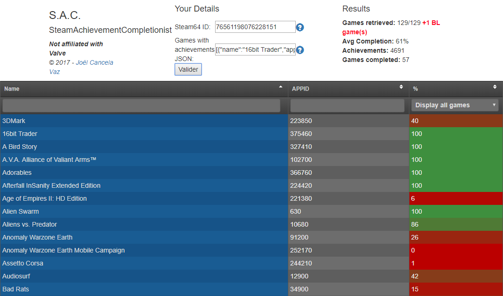

# S.A.C. (SteamAchievementCompletionist)


[]() []()

This project provides a simple view of the achievement completion for every game owned by a user on his Steam account.

## Preview


You can try it [here.](http://sac.joelcancela.fr/)

## Requirements

* You need to have a Steam account.
* You need to be at least level **10**.

## How to use

* Get your STEAM64 ID and copy-paste it in the field **Steam64 ID**
* Go to your Steam profile and click on **Edit profile**
* Open console (F12) and type :
```js
copy(g_rgAchievementShowcaseGamesWithAchievements);
```
this command will copy to the Clipboard the games you have at least one achievement unlocked in
    
* Paste (CTRL+V) in the field **Games with achievements JSON**
* Press **Submit**
* Enjoy and have a good achievement hunting.

## Notes

* There are some games (mostly demos) that counts in the Steam achievement percentage but aren't in the Games with achievements JSON, I made a blacklist which will be used to retrieve them all. If the count on SAC isn't the same as in your profile, please notify [joel.cancelavaz@gmail.com](mailto:joel.cancelavaz@gmail.com)
* You'll have to remake the *Edit profile* manipulation to keep your listing up-to-date.

## Blacklisted Games

| Name                      | APPID |
| :-------------------------: | :-------: |
| The Stanley Parable Demo  | 247750  |

## Built With

* [Bootstrap v3.3.7](https://getbootstrap.com/docs/3.3/) - The web framework used
* [tablesorter (fork by Rob Garrison)](https://mottie.github.io/tablesorter/docs/) - Dependency Management

## Uses

* [Steam Web API](https://developer.valvesoftware.com/wiki/Steam_Web_API)

## Commendation

Here's a site that does the same thing as this project: [completionist.me](https://completionist.me).

## License

This project is licensed under the MIT License - see the [LICENSE.md](LICENSE.md) file for details